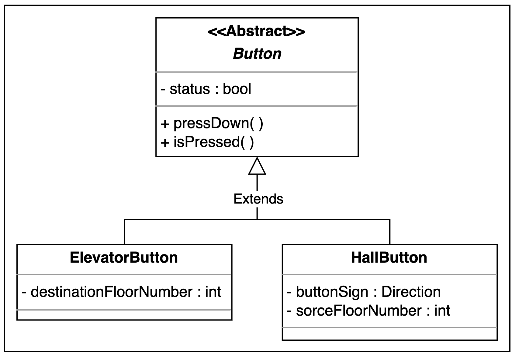

# Class Diagrams

### **Button**

`Button` is an abstract class. There can be two types of buttons i.e., the elevator button and the hall button. The status of the button determines whether the button is pressed or unpressed. We can press the button or check the status of the button through the `Button` class.

The `ElevatorButton` subclass is inherited from the `Button` class and represents the buttons that are inside the elevator. When the elevator button is pressed, it specifies what would be the destination floor of the elevator car or where the passenger wants to go.

Similar to `ElevatorButton`, `HallButton` is also a subclass of the `Button` class. This class represents the buttons that are outside the elevator. This class used the enumeration Direction to specify whether the button is for going up or down. The hall button has two important pieces of information, the floor from where the button is pressed and the direction in which the passenger wants to move.

The UML representation of these classes is shown below:

The class diagram of Button and its derived classes

### **Elevator panel and hall panel**

`ElevatorPanel` is a class which is used to represent the complete grid of buttons inside the elevator. In the elevator panel, we will have a list of buttons for selecting the destination floor of the elevator and two buttons for closing and opening the elevator.

While the `HallPanel` class represents the buttons that are outside the elevators. The hall panel consists of only two buttons: up and down*.*

Both the elevator panel and the hall panel are used to take input from the passenger. The representation of both classes is given below:

The class diagram of the HallPanel and ElevatorPanel classes

### **Display**

Every elevator has a display to represent the current floor number and direction (up or down) of an elevator. It also gives information about the capacity of the elevator. So we will use the `Display` class which represents this information. The `Display` class consists of floor number, capacity, and direction. It has separate methods for both elevator display and hall display. The `showHallDisplay()` will present only the current floor the lift is in and the direction of the lift while the `showElevatorDisplay()` will display all of the class attributes. The class representation is provided below:

The class of diagram of the Display class

### **Door**

The `Door` class symbolizes the door of an elevator. This class has a reference to enum `DoorState` which depicts that the status of the door can be either open or closed. A simple representation of the `Door` class is provided below:

The class diagram of the Door class

### **Elevator car**

`ElevatorCar` is the class that expresses the elevators of the building. Each elevator has a unique ID. This class consists of an enumeration named `state` that tells the present state of the elevator. Moreover, in every elevator car, there is a door, an elevator panel, and a display. The elevator car can start moving or stop on any floor. The UML expression of the class is as follows:

The class diagram of the ElevatorCar class

### **Floor**

The `Floor` class represents the floors of a building. Each floor consists of a number/list of hall panels to call the lift and has displays to indicate the current floor and direction of the lift since there is a separate panel and display for each elevator. Moreover, we will have `isBottomMost()` and `isTopMost()` functions to check if the floor is at the bottom or top, respectively. The down button will be disabled if the floor is at the lowest of the building and the up button will be disabled if the floor is topmost. The model of the `Floor` class is shown below:

### **Building**

The `Building` class represents an actual building that consists of the number of floors and elevators. This class is represented below:

### **Elevator system**

`ElevatorSystem` is the main functional class of the whole elevator control system. The elevator system has a display of each elevator and monitors the elevator cars. The elevator system has a `dispatcher` to select the best elevator car. Moreover, the system takes control of the elevator doors. The UML representation of a class is given below:

### **Enumerations**

Enumeration is generally a data type in which only a specific set of constants can be stored. Following is the list of enumerations required in the elevator system:

`ElevatorState`: It describes the state of an elevator, which could be idle, up, or down.

`Direction`: When the elevator is not in an idle state, it describes the direction of the motion of an elevator which could be up or down.

`DoorState`: When the elevator is in an idle state, it describes the status of a door of an elevator that could be open or close.

### Complete Class Diagram

