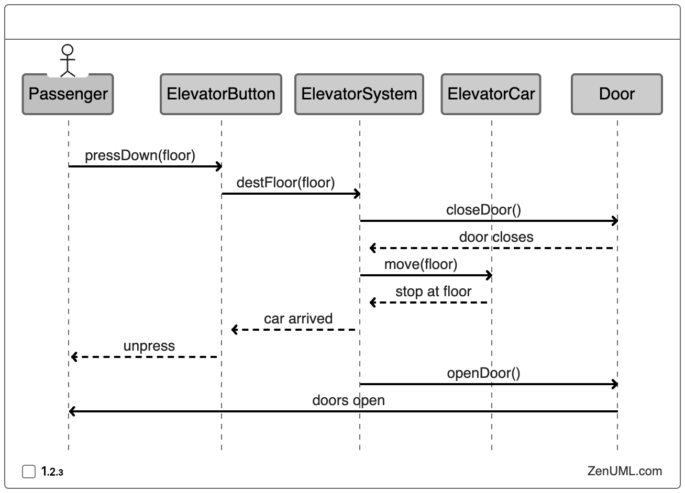

# Sequencing
Here are the steps in the elevator ride interaction:

1. **Passenger presses the down button**:
    - The passenger at a particular floor presses the down button (indicated by `pressDown(floor)`), signaling that they want to go to a lower floor.
2. **ElevatorButton sends the destination floor to the ElevatorSystem**:
    - Once the button is pressed, the `ElevatorButton` sends a message to the `ElevatorSystem` with the desired floor as the destination (indicated by `destFloor(floor)`).
3. **ElevatorSystem tells ElevatorCar to close the door**:
    - The `ElevatorSystem` processes the request and instructs the `ElevatorCar` to close the door (indicated by `closeDoor()`).
4. **ElevatorCar closes the door**:
    - The door starts closing (indicated by `door closes`), which is a prerequisite before the elevator can start moving.
5. **ElevatorCar starts moving to the requested floor**:
    - Once the doors are closed, the `ElevatorCar` begins to move towards the requested floor (indicated by `move(floor)`).
6. **ElevatorCar arrives at the floor and stops**:
    - The `ElevatorCar` reaches the destination floor and comes to a stop (indicated by `stop at floor`).
7. **ElevatorCar sends a signal back to the ElevatorSystem indicating arrival**:
    - The elevator indicates to the `ElevatorSystem` that it has arrived at the destination (indicated by `car arrived`).
8. **ElevatorButton is unpressed**:
    - The button that was pressed earlier is now reset or unpressed (indicated by `unpress`).
9. **ElevatorCar opens the door**:
    - Finally, the `ElevatorCar` opens the door for the passenger to exit (indicated by `openDoor()`).
10. **Door opens**:
    - The door is fully open, allowing the passenger to leave the elevator (indicated by `doors open`).

This sequence represents a typical interaction between a passenger and an elevator system, covering all key actions from pressing the button to the elevator arriving and opening its doors at the desired floor.

